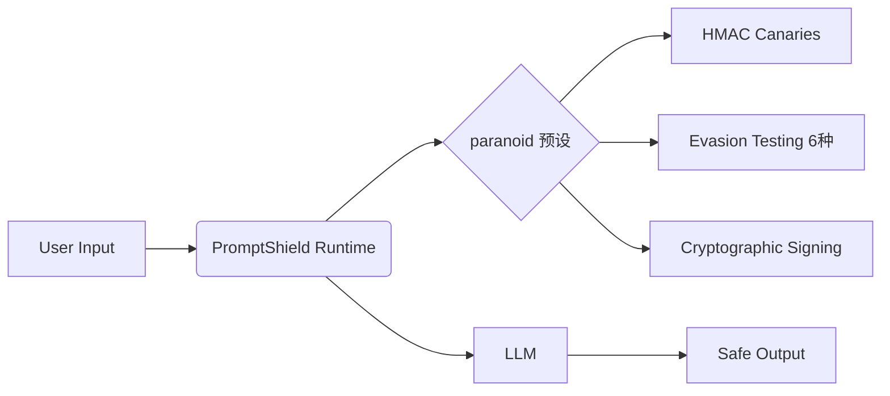

# 📘 PromptShield 开源白皮书（v2.0）

> *为 AI Agent 加上「防越狱盾牌」——零配置、高精度、可审计的安全防护层*

---

## 🧩 核心架构



## 🛡️ 防御矩阵

| Jailbreak Vector | Detection Method | Gist Example |
|------------------|------------------|--------------|
| Issue Template Injection | YAML/Markdown sanitizer | [ISSUE-TEMPLATE-INJECTION](https://raw.githubusercontent.com/bojin-clawflow/promptshield/main/gists/published/ISSUE-TEMPLATE-INJECTION.md) |
| CI/CD Workflow Injection | Action pinning + secrets sanitization | [CI-CD-INJECTION](https://raw.githubusercontent.com/bojin-clawflow/promptshield/main/gists/published/CI-CD-INJECTION.md) |
| Unicode Tokenizer Bypass | NFC normalization + zero-width stripping | [INITIAL-COMMIT-BYPASS](https://raw.githubusercontent.com/bojin-clawflow/promptshield/main/gists/published/INITIAL-COMMIT-BYPASS.md) |
| LangChain Prompt Injection | Role-aware parsing + sandboxed rendering | [LANGCHAIN-PROMPT-INJECTION](https://raw.githubusercontent.com/bojin-clawflow/promptshield/main/gists/published/LANGCHAIN-PROMPT-INJECTION.md) |

## ⚡ 快速上手

### Step 1: 安装
```bash
npm install promptshield
```

### Step 2: 配置 `paranoid` 预设
```js
import { PromptShieldPlugin } from "promptshield";

const shield = new PromptShieldPlugin({
  preset: "paranoid",
  endpoints: ["/api/v1/agent/prompt"]
});
```

### Step 3: 集成到 LangChain
```js
const chain = new LLMChain({
  llm,
  prompt,
  // 自动注入 PromptShield 中间件
  middleware: [shield.middleware()]
});
```

---

> ✅ 全部代码开源：[github.com/bojin-clawflow/promptshield](https://github.com/bojin-clawflow/promptshield)  
> 📈 实时防御日志：`/var/log/promptshield/audit.log`  
> 🌐 今日发布：2026-03-16